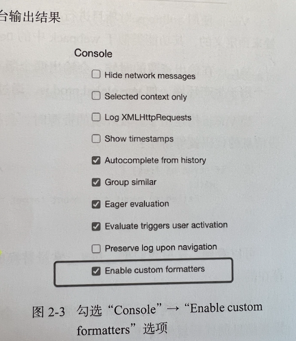

## 第二章、框架核心的设计要素

### 2.1 提升用户开发体验

#### 2.1.1良好的报错信息

- 衡量一个框架是否足够优秀则是看它的开发体验如何。
- 当我们创建一个Vuejs应用并试图将其挂载到一个不存在的**DOM**节点时，就会收到一条报错信息。`[Vue warn]: Failed to mount app: mount target selector '#not exit' returned null.`，这条信息告诉我们挂载失败的原因：Vuejs根据我们提供的选择器**无法找到响应的DOM**元素（返回null）。从而使得我们可以快速定位问题。

#### 2.1.2 良好的控制台使用

- 当使用vue3的ref变量的时候，我们在控制台可以看到是console的内容为一个proxy变量。
- 想要很直观地看到值，我们可以打开**Chrome**开发者工具勾选上`Console => Enable custom formatters`，从而可以看到更直观的输出内容。



### 2.2 控制框架代码的体积

#### 2.2.1 通过`__DEV__`来控制打包的报错

- rollup对项目构建，通过`__DEV__`常量来进行类似插件的配置。（其功能类似webpack中的DefinePlugin插件。）
- Vuejs构建用于**开发环境的资源时**，会把`__DEV__`常量设置的`true`，这上面那段输出警告信息的代码就等价于:

```js
if(true && !res){
  warn(
  	`Failed to mount app: mount target selector ${container} returned null`
  )
}
```

- Vuejs构建用于生产环境的资源时，会把`__DEV__`常量设置为`false`,这上面那段输出警告信息的代码就等价于

```js
if(false && !res){
  warn(
  	`Failed to mount app: mount target selector "${container} returned null}"`
  )
}
```

根据上面可以看到，`__DEV__`常量替换为`false`，这段代码永远都不会运行，那么在**构建资源的时候就会被移除。**

### 2.3 框架要做到良好的Tree-Shaking

- **概念**：Tree-Shaking指的就是**消除**那些永远不会执行的代码。
- 在rollup的Tree-Shaking的中，没有执行的代码则**不会**出现在打包中。
- **副作用概念**：如果一个函数调用会产生副作用，那么就不能将其移除。什么是副作用？副作用就是，当调用函数的时候会对外部产生影响，**例如修改了全局变量。**
- 告诉rollup打包的时，放心吧，这段代码不会产生副作用，你可以移除它。添加注释`/*#__PURE__*/`，要注意此时也是告诉了rollup.js，对于某个函数的调用不会产生副作用。

### 2.4 框架应该输出怎样的构建产物

- 首先我们希望用户可以直接在HTML页面中使用`<script>`Vuejs，此时需要输出一种叫做IIFE格式的资源。
- 通过修改`package.json`中的`module`来控制资源来代替main字段指向的**资源的优先级**。
- 带有 `-browser`字样的ESM资源是直接给`<script type='module'>`使用的。那么`-browser`和`-bundler`的区别则是，当构建用于`<script>`标签的资源时。如果是开发环境则`__DEV__` 设置为`true`。当时生产环境，那么`__DEV__`常量设置为`false`，从而可以被`Tree-Shaking移除`。
- 不过我们不可以直接把`__DEV__`设置为true或者false，通常需要使用 `(process.env.NODE_ENV !== 'production')`替换`__DEV__常量`，从而为了实现用户能在webpack配置中自行决定构建资源的目标环境。
- 服务端渲染，我们将支持`require()`引入，将`rollup`打包的`format`修改为'cjs'

### 2.5 特性开关

- 对于用户关闭的特性，我们可以利用`Three-Shaking`机制让其不包含在最终的资源中。
- 该机制为框架设计带来了灵活性，可以通过特性开关任意为框架添加新的特性，而不用担心资源体积变大。同时，当框架升级时，我们也可以通过特性开关来支持**遗留的API**，这样新用户**可以选择不使用遗留API**，从而使最终打包的资源体积最小化。
- 在`__VUE_OPTIONS_API__`是一个特性开关，用户可以通过这个值来预定义常量的值来控制是否需要一下这段代码：

```js
// 用户可以使用webpack.DefinePlugin来实现
// webpack.DefinePlugin配置

new webpack.DefinePlugin({
  __VUE_OPTIONS_API__: JSON.stringify(true) // 开启特性
})

// 这样用户就可以自主选择是否要开启 __VUE_OPTIONS_API 了
```

### 2.6 错误处理

- 错误处理是框架开发过程中非常重要的环节。框架错误处理机制的好坏直接决定了用户应用程序的健壮性，还是决定了用户开发时错误的心智负担。

- 在Vue3框架中，提供了 `registerErrorHandler`函数，用户可以使用它注册错误处理程序，然后在 `callWithErrorHandling` 函数内部捕获错误后，把错误传递给用户注册的错误处理程序。

```js
import utils from 'utils.js'
// 注册错误处理程序
utils.registerErrorHandler((e) => {
  console.log(e)
})

utils.foo(() => {/*....*/})
utils.bar(() => {/*....*/})
```

- 在Vue3源码中，你可以搜索到 `callWithErrorHandling`函数。另外我们也可以注册统一的错误处理函数:

```js
import App from 'App.vue'
const app = create(app)
app.config.errorHandler = () => {
  // 错误处理程序
}
```

### 2.7 良好的TypeScript类型支持

- 在Vue3中引入的TS（JS）超集，来对项目的整个类型系统进行规范。

```js
function foo(val:any){
  return val
}
```

- 上述代码就是将返回参数返回，可以是任意类型，但是函数的返回值的类型TS是没法帮我们推导出来的。因此我们需要修改代码：

```js
function foo<T extends any>(value: T):T {
  return val
}
```

- 根据代码修改，我们可以通过传入的T泛型来让TS帮我们推导出来函数的返回结果的类型。
- 想要做到完善的TS的类型是很不容易的，可以查看Vuejs源码中的`runtime-core/src/apiDefineComponent.ts`文件。整个文件里真正在浏览器中运行的代码其实只是3行。
