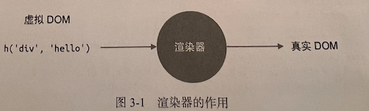

## 第三章、Vue.js3 的设计思路

### 3.1 声明式地描述UI

- 1. **模板声明**

```js
<div id='app'></div>
<div :id='dynamicId'></div>
<div @click='handler'></div>
```

- 2. **通过JavaScript对象来描述**

```js
const title = {
  // 标签名字
  tag: "h1",
  props: {
    onClick: handler
  },
  children: [
    {tag: 'span'}
  ]
}

<h1 @click='handler'><span></span></div>
```

- 3. **h函数**：有一个组件要渲染的内容是通过渲染函数来描述的，也就是上面代码中的**render函数。**

```js
import { h } from 'vue'

export default {
  render(){
    return h('h1', { onClick: handler })
  }
}
```

- 优点： 使用模板和JavaScript对象描述UI有什么区别吗？使用JavaScript对象描述的UI更加的**灵活**。

```js
// h 标签的级别
let level = 3
const title = {
  tag: `h${level}`, // h3标签
}
```

### 3.2 初识渲染器

- 虚拟DOM  => 真实DOM



- render函数

```js
// vnode
const vnode = {
  tag: 'div',
  props: {
    onClick: () => alert('hello')
  },
  children: 'click me'
}
```

```js
function renderer(vnode,container){
  // 使用 vnode.tag 作为标签名称创建 DOM 元素
  const el = document.createElement(vnode.tag)
  // 遍历 vnode.props，将属性、事件添加到 DOM元素
  for(const key in vnode.props){
    if(/^on/.test(key)){
      // 如果 key 以 on 开头，那么说明它是一个事件
      el.addEventListener(
        key.substr(2).toLowerCase() // 事件名称 onClick ===> click
        vnode.props[key] // 事件处理函数
      )
    }
  }
  
  // 处理 children
  if(typeof vnode.children === 'string'){
    // 如果 children 是字符串，说明它是元素的文本子节点
    el.appendChild(document.createTextNode(vnode.children))
  } else if(Array.isArray(vnode.children)){
    // 递归地 调用 renderer 函数渲染子节点，使用当前元素 el 作为挂载点
    vnode.children.forEach(child => renderer(child,el))
  }
  
  // 将元素添加到挂载点下
  container.appendChild(el)
}
```

- 上述代码三步走
  - 创建元素
  - 为元素添加属性和事件
  - 处理children： 注意使用递归调用
